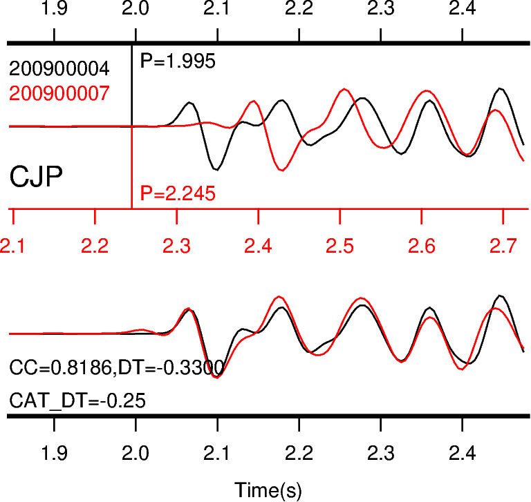

# BCSEIS 地震互相关计算程序的Python实现

## 依赖库：
obspy,pandas,pyasdf

pygmt（用于画图，可选）

## 输出结果
直接对asdf地震数据格式进行互相关计算，输出hypoDD的dt.cc格式

## 结果绘图
使用pygmt对dt.cc进行画图

## 参考文献
Wen-Xuan Du, Clifford H. Thurber, Donna Eberhart-Phillips; Earthquake Relocation Using Cross-Correlation Time Delay Estimates Verified with the Bispectrum Method. Bulletin of the Seismological Society of America ; 94 (3): 856–866. doi: https://doi.org/10.1785/0120030084

Lion Krischer, James Smith, Wenjie Lei, Matthieu Lefebvre, Youyi Ruan, Elliott Sales de Andrade, Norbert Podhorszki, Ebru Bozdağ, Jeroen Tromp, An Adaptable Seismic Data Format, Geophysical Journal International, Volume 207, Issue 2, 1 November 2016, Pages 1003–1011, https://doi.org/10.1093/gji/ggw319

This is the Adaptable Seismic Data Format - if you are looking for the Advanced Scientific Data Format, go here: https://asdf.readthedocs.io/en/latest/

pyasdf:https://seismicdata.github.io/pyasdf/index.html
